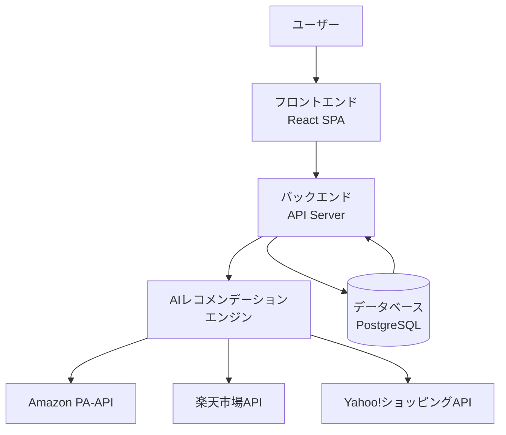
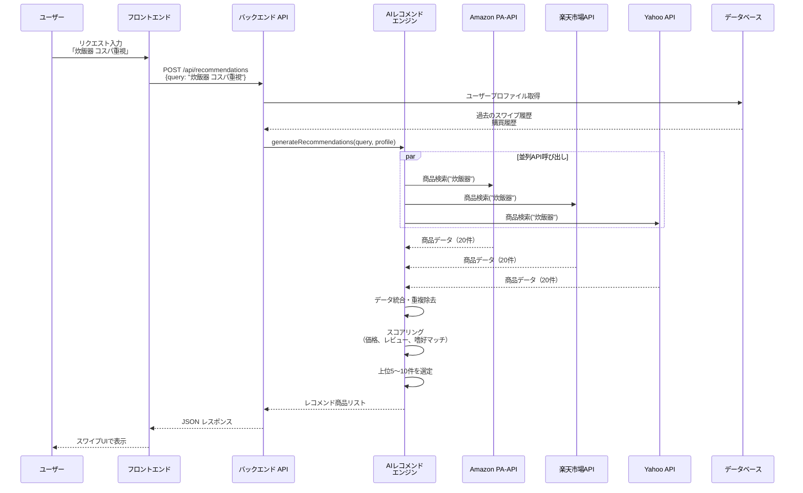
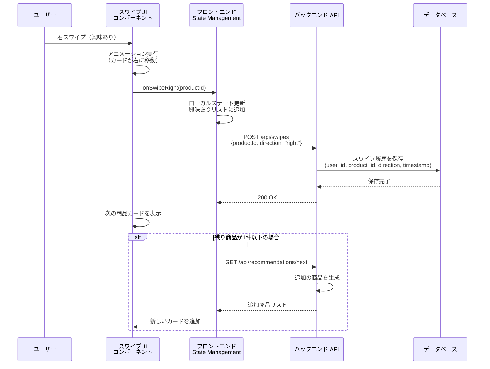
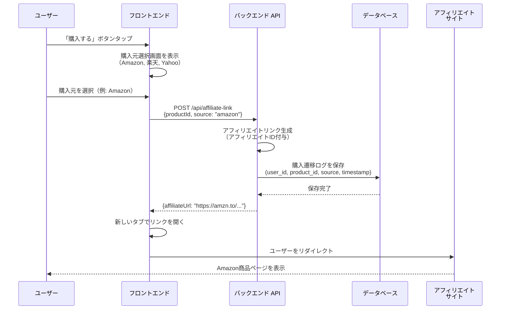
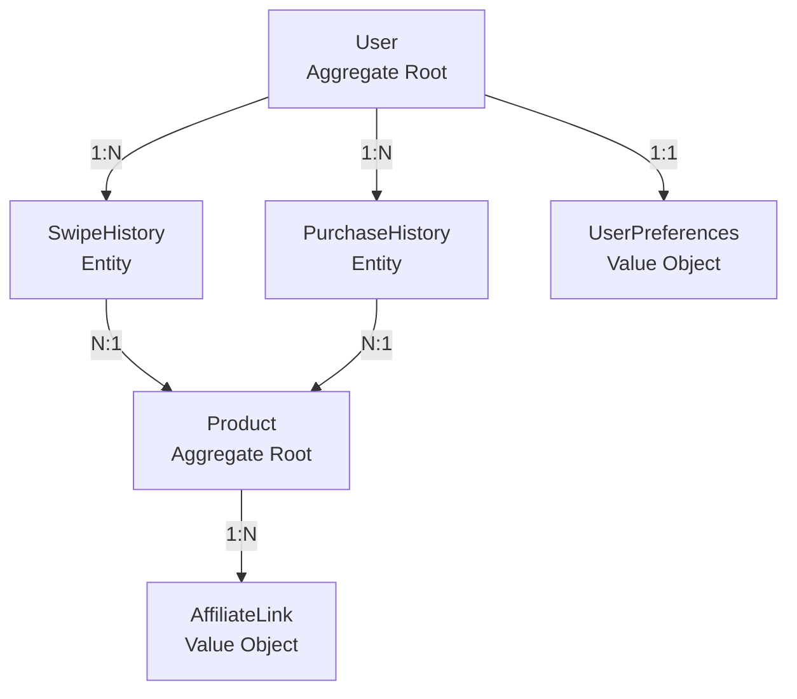
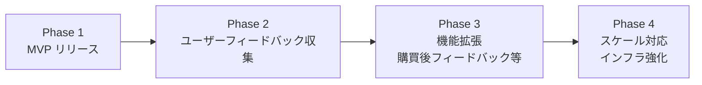

# Technical Design Document

## Overview

UR-pickプラットフォームは、Decision Fatigue（選択疲れ）を解消するAI搭載のショッピングプラットフォームです。従来のECサイトが提供する膨大な商品カタログを排除し、ユーザーのリクエストに基づいてAIが厳選した5〜10件の商品のみをTinder型スワイプUIで提示します。ユーザーはシンプルなスワイプ操作で「興味あり」「興味なし」を選択し、興味のある商品をアフィリエイトリンク経由で購入できます。

**ターゲットユーザー**: 高齢者（60歳以上）、忙しい共働き夫婦（30-40代）、選択に疲れた全世代。これらのユーザーは、商品リクエストの入力、AIレコメンドの閲覧、スワイプ操作での選択、購入遷移という直線的なフローで購買を完了します。

**システムの影響**: 本プラットフォームは完全な新規システムであり、既存システムの変更は伴いません。アフィリエイトモデルを採用するため、在庫・物流・決済は外部ECサイト（Amazon、楽天、Yahoo!ショッピング等）に委譲します。

### Goals

- **Decision Fatigueの解消**: 5〜10件に厳選された商品提示により、ユーザーの意思決定負担を最小化
- **高いコンバージョン率**: Tinder型UIにより従来ECの3〜5倍のコンバージョン率を達成
- **パーソナライゼーション**: スワイプ行動と購買履歴を学習し、使うほど精度が向上するレコメンド体験
- **Apple級のUX**: ミニマルで美しいデザインにより、高齢者から若者まで誰もが快適に利用できるUI
- **MVP迅速リリース**: 初回リリースまでの期間を最小化し、早期にユーザーフィードバックを獲得

### Non-Goals

- 自社での決済処理（アフィリエイトモデルのため外部サイトに委譲）
- 在庫管理・物流管理（アフィリエイトモデルのため不要）
- カスタマーサポートチャット機能（MVPフェーズでは対象外）
- ソーシャルログイン（Google、Facebook等）（将来的な拡張）
- 多言語対応（日本語のみでスタート）
- 音声入力対応（将来的な拡張）
- AR/VR商品プレビュー（将来的な拡張）

---

## Architecture

### High-Level Architecture

UR-pickプラットフォームは、**クライアント-サーバー型のWebアプリケーション**として設計されます。フロントエンドはReact SPAとして実装し、バックエンドはNode.js（Express）またはPython（FastAPI）で構築します。AIレコメンデーションエンジンはバックエンドの一部として実装し、複数のアフィリエイトAPI（Amazon PA-API、楽天市場API、Yahoo!ショッピングAPI）からデータを取得します。



**アーキテクチャの特徴**:
- **シンプルなレイヤー構成**: プレゼンテーション層（Frontend）、アプリケーション層（Backend）、データ層（DB）の3層アーキテクチャ
- **外部依存の最小化**: アフィリエイトAPIのみに依存し、決済・物流等の複雑な外部連携を排除
- **スケーラビリティ**: ステートレスなAPI設計により、水平スケールが容易
- **モダンな技術スタック**: React、TypeScript、Node.js/FastAPIといった実績のある技術を採用

---

### Technology Stack and Design Decisions

#### Frontend

**選択**: React 18+ with TypeScript
**根拠**:
- **React**: コンポーネントベースの設計により、スワイプカードやボタン等のUI要素を再利用可能
- **TypeScript**: 型安全性により、バグを早期に発見し、開発効率を向上
- **豊富なエコシステム**: スワイプUI実装に必要なライブラリ（react-spring、framer-motion等）が充実

**代替案**:
- **Vue.js**: Reactと同様の機能を提供するが、エコシステムの規模でReactに劣る
- **Next.js**: SSRによるSEO改善が可能だが、MVPフェーズではSPAで十分
- **選定理由**: Reactの豊富なライブラリとコミュニティサポートを優先

#### Backend

**選択**: Node.js (Express) with TypeScript
**根拠**:
- **Node.js**: 非同期I/Oに優れ、複数のアフィリエイトAPIへの並行リクエストに最適
- **Express**: シンプルで柔軟なフレームワーク、学習コストが低い
- **TypeScript**: フロントエンドと同じ言語を使用することで、型定義を共有し開発効率を向上

**代替案**:
- **Python (FastAPI)**: AIライブラリとの統合が容易だが、非同期処理の複雑さが増す
- **Go**: パフォーマンスに優れるが、開発速度がNode.jsに劣る
- **選定理由**: 開発速度とエコシステムの充実度を優先し、Node.jsを選択

#### Database

**選択**: PostgreSQL 15+
**根拠**:
- **リレーショナルDB**: ユーザー、スワイプ履歴、購買履歴の関連性を表現しやすい
- **JSONB型**: ユーザープロファイルや商品情報等の柔軟なデータ構造を保存可能
- **成熟度**: 実績があり、運用ノウハウが豊富

**代替案**:
- **MongoDB**: ドキュメント型DBだが、リレーショナルなデータ構造には不向き
- **MySQL**: PostgreSQLと同等の機能を持つが、JSONB型のサポートが弱い
- **選定理由**: JSONB型によるスキーマの柔軟性とリレーショナルモデルのバランスを重視

#### AI/ML

**選択**: Claude Sonnet 4.5 (Anthropic) / OpenAI API (GPT-4) / Google Gemini API
**根拠**:
- **Claude Sonnet 4.5（推奨）**: 最新モデルで高精度。コスト効率が非常に高く（GPT-4の約1/10）、日本語処理に優れる。200Kトークンのコンテキストウィンドウでスワイプ履歴を多く含められる
- **高精度なNLP**: ユーザーのリクエスト（「とにかくコスパがいいやつ」等）を理解し、適切な商品を推薦
- **迅速な統合**: APIとして提供されるため、自前でモデルを訓練する必要がない
- **コスト効率**: 従量課金制で、MVPフェーズの低トラフィックに適している

**代替案**:
- **OpenAI API (GPT-4)**: 最も広く使われており実績があるが、コストが高い（入力$30/1Mトークン、出力$60/1Mトークン）
- **Google Gemini API**: 無料枠が大きいが、日本語精度がClaudeに劣る
- **自前のML モデル（scikit-learn、TensorFlow等）**: カスタマイズ性が高いが、開発コストが高い
- **ルールベースのレコメンド**: 実装は簡単だが、パーソナライゼーション精度が低い
- **選定理由**: Claude Sonnet 4.5を第一候補とし、コスト効率と日本語精度を優先。MVPフェーズでは迅速な統合と高精度を優先し、外部APIを活用

#### Hosting/Infrastructure

**選択**: Vercel (Frontend) + Railway/Render (Backend) + Supabase (Database)
**根拠**:
- **Vercel**: Reactアプリの高速デプロイとCDN配信に最適
- **Railway/Render**: Node.jsアプリの簡単なデプロイとスケーリング
- **Supabase**: PostgreSQLのマネージドサービス、無料枠が充実

**代替案**:
- **AWS/GCP**: スケーラビリティに優れるが、初期設定が複雑
- **Heroku**: 簡単だが、コストが高い
- **選定理由**: MVPフェーズでは低コストと迅速なデプロイを優先

---

### Key Design Decisions

#### Decision 1: アフィリエイトAPI統合戦略

**Decision**: 複数のアフィリエイトAPI（Amazon、楽天、Yahoo!ショッピング）を統合し、商品データを一元的に取得する

**Context**: ユーザーに幅広い選択肢を提供するため、複数のECサイトから商品情報を取得する必要がある。また、各サイトでの価格比較を可能にすることで、ユーザー体験を向上させる。

**Alternatives**:
1. **単一APIのみ使用（Amazon PA-API）**: 実装は簡単だが、商品の選択肢が限定される
2. **全てのAPIを並列呼び出し**: 最も幅広い選択肢を提供できるが、レスポンスタイムが長くなる
3. **ユーザーの嗜好に基づいてAPIを選択的に呼び出し**: パーソナライゼーションは向上するが、初回ユーザーには対応できない

**Selected Approach**: 全てのAPIを並列呼び出しし、レスポンスタイムを最適化するためにキャッシングと非同期処理を活用

**Rationale**:
- **幅広い商品選択肢**: 複数のECサイトから商品を取得することで、ユーザーに最適な商品を提案できる
- **価格比較**: 同一商品を複数サイトで比較することで、ユーザーは最安値を選択できる
- **冗長性**: 一つのAPIが障害を起こしても、他のAPIでカバーできる

**Trade-offs**:
- **実装複雑性**: 各APIの仕様が異なるため、統合コードが複雑になる
- **レスポンスタイム**: 複数APIの呼び出しにより、レスポンスタイムが長くなる可能性がある（→ キャッシングで対応）

---

#### Decision 2: スワイプUIの実装方法

**Decision**: React SpringおよびReact Use Gestureを使用して、ネイティブアプリ級のスムーズなスワイプ体験を実装

**Context**: Tinder型UIの成功には、60fps以上のスムーズなアニメーションが不可欠。高齢者でも直感的に操作できるレスポンシブな体験が求められる。

**Alternatives**:
1. **CSS Transitionのみ**: 実装は簡単だが、複雑なジェスチャー（スワイプ途中での引き戻し等）に対応できない
2. **Framer Motion**: 宣言的なアニメーション定義が可能だが、ジェスチャー処理が弱い
3. **React Spring + React Use Gesture**: 物理ベースのアニメーションと高度なジェスチャー処理を両立

**Selected Approach**: React Spring + React Use Gesture

**Rationale**:
- **ネイティブ級の体験**: 物理ベースのアニメーション（慣性、バウンス等）により、スマホアプリと同等の体験を提供
- **高度なジェスチャー対応**: スワイプ途中での引き戻し、速度に応じた動作変更等、細かい制御が可能
- **パフォーマンス**: GPU加速を活用し、60fps以上のスムーズな動作を実現

**Trade-offs**:
- **学習コスト**: React SpringとReact Use Gestureの学習が必要
- **バンドルサイズ**: ライブラリの追加によりバンドルサイズが増加（→ 適切なコード分割で対応）

---

#### Decision 3: AIレコメンドアルゴリズムの設計

**Decision**: ハイブリッドレコメンデーション（ルールベース + LLMベース）を採用

**Context**: 初回ユーザーには過去データがないため、ルールベースのレコメンドが必要。一方、リピートユーザーには、LLMを活用したパーソナライズドレコメンドを提供する。

**Alternatives**:
1. **ルールベースのみ**: 実装は簡単だが、パーソナライゼーション精度が低い
2. **協調フィルタリング**: ユーザー数が少ないMVPフェーズでは精度が低い
3. **LLMベースのみ**: 初回ユーザーにも対応できるが、コストが高い

**Selected Approach**:
- **初回ユーザー**: ルールベース（リクエストキーワードマッチング + 人気商品スコア）
- **リピートユーザー**: LLMベース（スワイプ履歴と購買履歴をプロンプトに含め、パーソナライズされた商品を推薦）

**Rationale**:
- **コスト効率**: 初回ユーザーにはコストの低いルールベースを適用
- **高精度パーソナライゼーション**: リピートユーザーにはLLMを活用し、嗜好を深く理解した推薦を提供
- **段階的な学習**: ユーザーがスワイプするたびにデータが蓄積され、レコメンド精度が向上

**Trade-offs**:
- **複雑性**: ルールベースとLLMベースの2つのロジックを管理する必要がある
- **コスト**: LLM APIの利用により、ユーザー数が増加するとコストが増加（→ キャッシングとバッチ処理で最適化）

---

## System Flows

### User Request to Recommendation Flow

ユーザーが商品リクエストを入力してから、AIレコメンド商品が表示されるまでのフローを示します。



**フローの特徴**:
- **並列処理**: 複数のアフィリエイトAPIを並列で呼び出し、レスポンスタイムを最小化
- **パーソナライゼーション**: ユーザープロファイル（過去のスワイプ履歴・購買履歴）を考慮してスコアリング
- **10秒以内のレスポンス**: 要件で定義された10秒以内のレスポンスタイムを遵守

---

### Swipe Interaction Flow

ユーザーがスワイプ操作を行った際のフロントエンド〜バックエンド間の処理フローを示します。



**フローの特徴**:
- **オプティミスティックUI**: スワイプ直後にローカルステートを更新し、ユーザー体験を向上
- **非同期保存**: スワイプ履歴の保存は非同期で行い、UI操作をブロックしない
- **無限スクロール**: 残り商品が少なくなると自動的に追加商品を読み込む

---

### Purchase Transition Flow

ユーザーが「購入する」ボタンをタップした際の処理フローを示します。



**フローの特徴**:
- **価格比較**: 複数の購入元を提示し、ユーザーが最適な選択肢を選べる
- **アフィリエイト収益化**: アフィリエイトIDを付与したリンクを生成し、収益を確保
- **トラッキング**: 購入遷移ログを保存し、コンバージョン率を追跡

---

## Requirements Traceability

主要な要件と、それを実現するコンポーネント・インターフェース・フローの対応関係を示します。

| Requirement | 要件概要 | Components | Interfaces | Flows |
|-------------|---------|------------|------------|-------|
| 1.1 | リクエスト入力画面に検索バーを中央に大きく表示 | RequestInputPage | - | - |
| 1.2 | テキストリクエストを受け付け、AIレコメンデーション処理を開始 | Backend API, AIRecommendationEngine | POST /api/recommendations | User Request to Recommendation Flow |
| 2.1 | 複数のアフィリエイトAPIから商品データを取得 | AIRecommendationEngine | Amazon PA-API, 楽天市場API, Yahoo API | User Request to Recommendation Flow |
| 2.7 | レコメンド処理を10秒以内に完了 | AIRecommendationEngine | - | User Request to Recommendation Flow |
| 3.3 | 右スワイプで「興味あり」としてマーク | SwipeCardComponent | POST /api/swipes | Swipe Interaction Flow |
| 3.7 | 60fps以上のスムーズなアニメーション | SwipeCardComponent (React Spring) | - | Swipe Interaction Flow |
| 5.4 | アフィリエイトリンクを生成し、商品ページを開く | AffiliateLinkService | POST /api/affiliate-link | Purchase Transition Flow |
| 6.2 | バナー広告、ポップアップを一切表示しない | 全UIコンポーネント | - | - |
| 7.2 | スワイプ方向と商品情報をユーザープロファイルに記録 | UserProfileService | POST /api/swipes | Swipe Interaction Flow |

---

## Components and Interfaces

### フロントエンド層

#### RequestInputPage

**Responsibility & Boundaries**
- **Primary Responsibility**: ユーザーが商品リクエストを入力するための画面を提供
- **Domain Boundary**: プレゼンテーション層（UIのみ）
- **Data Ownership**: ローカルステート（入力中のテキスト）のみを管理

**Dependencies**
- **Inbound**: ユーザー（トップレベルコンポーネント）
- **Outbound**: Backend API（/api/recommendations）
- **External**: なし

**Contract Definition**

UI Contract:
- 検索バーを画面中央に大きく配置
- プレースホルダーテキスト: 「何をお探しですか？（例: 炊飯器 コスパ重視）」
- 入力後、Enterキーまたは検索ボタンでリクエスト送信
- ローディング状態を表示（3秒以内にローディングインジケーターを表示）

API Contract:
| Method | Endpoint | Request | Response | Errors |
|--------|----------|---------|----------|--------|
| POST | /api/recommendations | `{query: string}` | `{products: Product[]}` | 400 (無効なクエリ), 500 (サーバーエラー) |

---

#### SwipeCardComponent

**Responsibility & Boundaries**
- **Primary Responsibility**: Tinder型のスワイプUIを提供し、ユーザーが商品を「興味あり」「興味なし」で選別できるようにする
- **Domain Boundary**: プレゼンテーション層（UIとインタラクション）
- **Data Ownership**: 現在表示中の商品データと、ローカルのスワイプ状態

**Dependencies**
- **Inbound**: RecommendationPage（親コンポーネント）
- **Outbound**: Backend API（/api/swipes）
- **External**: React Spring（アニメーション）、React Use Gesture（ジェスチャー処理）

**Contract Definition**

Props Interface:
```typescript
interface SwipeCardProps {
  product: Product;
  onSwipeRight: (productId: string) => void;
  onSwipeLeft: (productId: string) => void;
  onCardTap: (productId: string) => void; // 詳細表示用
}

interface Product {
  id: string;
  name: string;
  price: number;
  imageUrl: string;
  description: string;
  source: 'amazon' | 'rakuten' | 'yahoo';
  affiliateUrl: string;
  rating: number;
  reviewCount: number;
  recommendReason: string; // AIが生成した推薦理由
}
```

**State Management**:
- **State Model**: IDLE（静止）→ DRAGGING（ドラッグ中）→ SWIPED_RIGHT / SWIPED_LEFT（スワイプ完了）
- **Persistence**: ローカルステートのみ（React useState）
- **Concurrency**: 単一カードのため、並行操作なし

**Preconditions**: productプロパティが有効なProduct型であること
**Postconditions**: スワイプ完了後、onSwipeRightまたはonSwipeLeftコールバックが呼ばれ、カードがDOMから削除される
**Invariants**: スワイプアニメーションは常に60fps以上で動作する

---

#### ProductDetailModal

**Responsibility & Boundaries**
- **Primary Responsibility**: 商品の詳細情報（説明、スペック、レビュー等）をモーダルで表示
- **Domain Boundary**: プレゼンテーション層（モーダルUI）
- **Data Ownership**: 表示する商品データ（親から受け取る）

**Dependencies**
- **Inbound**: SwipeCardComponent（カードタップ時に呼び出される）
- **Outbound**: なし
- **External**: なし

**Contract Definition**

Props Interface:
```typescript
interface ProductDetailModalProps {
  product: Product;
  isOpen: boolean;
  onClose: () => void;
  onSwipeRight: (productId: string) => void;
  onSwipeLeft: (productId: string) => void;
}
```

UI Contract:
- 下からスライドインでモーダルを表示
- 商品画像、名前、価格、説明、スペック、レビュー評価、レビュー数、販売元を表示
- モーダル内に「興味あり」「興味なし」ボタンを配置
- 背景タップまたは「閉じる」ボタンでモーダルを閉じる

---

### バックエンド層

#### RecommendationAPI

**Responsibility & Boundaries**
- **Primary Responsibility**: ユーザーのリクエストを受け付け、AIレコメンデーションエンジンを呼び出し、推薦商品をフロントエンドに返却
- **Domain Boundary**: アプリケーション層（APIエンドポイント）
- **Data Ownership**: リクエスト/レスポンスのデータのみ（永続化はしない）
- **Transaction Boundary**: 単一のHTTPリクエスト/レスポンスサイクル

**Dependencies**
- **Inbound**: フロントエンド（React App）
- **Outbound**: AIRecommendationEngine、UserProfileService
- **External**: なし

**API Contract**:

| Method | Endpoint | Request | Response | Errors |
|--------|----------|---------|----------|--------|
| POST | /api/recommendations | `{query: string, userId?: string}` | `{products: Product[], totalCount: number}` | 400 (無効なクエリ), 500 (サーバーエラー), 503 (アフィリエイトAPI障害) |
| GET | /api/recommendations/next | `{userId: string, lastProductId?: string}` | `{products: Product[]}` | 400, 404 (ユーザーが見つからない), 500 |

Request Schema:
```typescript
interface RecommendationRequest {
  query: string; // ユーザーのリクエスト（例: 「炊飯器 コスパ重視」）
  userId?: string; // 認証済みユーザーの場合に提供
}
```

Response Schema:
```typescript
interface RecommendationResponse {
  products: Product[];
  totalCount: number; // レコメンド対象となった全商品数
}
```

**Preconditions**: queryは空文字列ではない
**Postconditions**: 5〜10件の商品リストを返却、レスポンスタイムは10秒以内
**Invariants**: レコメンド商品は常にスコア順にソートされている

---

#### AIRecommendationEngine

**Responsibility & Boundaries**
- **Primary Responsibility**: ユーザーのリクエストとプロファイルに基づいて、最適な商品を選定し推薦する
- **Domain Boundary**: ドメイン層（ビジネスロジック）
- **Data Ownership**: レコメンドアルゴリズムのロジックとスコアリング基準
- **Transaction Boundary**: 単一のレコメンド生成処理

**Dependencies**
- **Inbound**: RecommendationAPI
- **Outbound**: AffiliateAPIClient、UserProfileService
- **External**: Amazon PA-API、楽天市場API、Yahoo!ショッピングAPI、Claude API / OpenAI API / Gemini API

**External Dependencies Investigation**:

**Amazon Product Advertising API (PA-API)**:
- **公式ドキュメント**: https://webservices.amazon.com/paapi5/documentation/
- **認証方式**: AWS署名バージョン4（Access KeyとSecret Keyを使用）
- **レート制限**: 1リクエスト/秒（無料アカウント）、10リクエスト/秒（有料アカウント）
- **主要エンドポイント**: SearchItems（商品検索）、GetItems（商品詳細取得）
- **レスポンス形式**: JSON
- **注意点**: 商品画像URLは24時間で期限切れになるため、定期的に再取得が必要

**楽天市場API**:
- **公式ドキュメント**: https://webservice.rakuten.co.jp/documentation/
- **認証方式**: アプリケーションID（クエリパラメータに付与）
- **レート制限**: なし（推奨は1秒あたり10リクエスト以下）
- **主要エンドポイント**: ItemSearch（商品検索）、ItemRanking（ランキング取得）
- **レスポンス形式**: JSON / XML
- **注意点**: アフィリエイトIDを含めることで収益化可能

**Yahoo!ショッピングAPI**:
- **公式ドキュメント**: https://developer.yahoo.co.jp/webapi/shopping/
- **認証方式**: Client ID（クエリパラメータに付与）
- **レート制限**: 1日あたり50,000リクエスト
- **主要エンドポイント**: itemSearch（商品検索）、categorySearch（カテゴリ検索）
- **レスポンス形式**: JSON / XML
- **注意点**: アフィリエイトリンク生成には別途バリューコマースとの契約が必要

**Claude API (Sonnet 4.5)**:
- **公式ドキュメント**: https://docs.anthropic.com/claude/reference/
- **認証方式**: x-api-key Header（APIキー）
- **レート制限**: ティアにより異なる（標準: 50リクエスト/分、プロ: 1000リクエスト/分）
- **主要エンドポイント**: /v1/messages
- **レスポンス形式**: JSON
- **コスト**: Sonnet 4.5: 入力$3/1Mトークン、出力$15/1Mトークン（GPT-4の約1/10）
- **コンテキストウィンドウ**: 200Kトークン
- **注意点**: 日本語処理に優れており、ユーザーのスワイプ履歴を多く含めたプロンプトに最適

**OpenAI API (GPT-4)**:
- **公式ドキュメント**: https://platform.openai.com/docs/api-reference
- **認証方式**: Bearer Token（APIキー）
- **レート制限**: モデルにより異なる（GPT-4: 3リクエスト/分、GPT-3.5-turbo: 60リクエスト/分）
- **主要エンドポイント**: /v1/chat/completions
- **レスポンス形式**: JSON
- **コスト**: GPT-4: $0.03/1Kトークン（入力）、$0.06/1Kトークン（出力）
- **注意点**: プロンプトが長いとコストが増加するため、簡潔なプロンプト設計が重要

**Service Interface**:
```typescript
interface AIRecommendationEngine {
  generateRecommendations(
    query: string,
    userProfile: UserProfile | null
  ): Promise<Result<Product[], RecommendationError>>;

  scoreProduct(
    product: RawProduct,
    query: string,
    userProfile: UserProfile | null
  ): number;
}

interface UserProfile {
  userId: string;
  swipeHistory: SwipeRecord[]; // 過去のスワイプ履歴
  purchaseHistory: PurchaseRecord[]; // 購買履歴
  preferredCategories: string[]; // 好きなカテゴリ
  preferredPriceRange: { min: number; max: number };
  preferredBrands: string[];
}

interface RawProduct {
  id: string;
  name: string;
  price: number;
  category: string;
  brand: string;
  rating: number;
  reviewCount: number;
  source: 'amazon' | 'rakuten' | 'yahoo';
}

type RecommendationError =
  | { type: 'API_ERROR'; message: string; source: string }
  | { type: 'TIMEOUT'; message: string }
  | { type: 'NO_RESULTS'; message: string };
```

**Algorithm Overview**:
1. **商品データ取得**: 3つのアフィリエイトAPIを並列で呼び出し、各20件ずつ取得（合計60件）
2. **データ統合**: 重複商品を除去（商品名とブランドで判定）
3. **スコアリング**:
   - **ベーススコア**: 価格（安い方が高スコア）、レビュー評価、レビュー数
   - **クエリマッチスコア**: リクエストキーワードとの一致度（例: 「コスパ」→ 価格/性能比を重視）
   - **パーソナライズスコア**: ユーザープロファイルとの一致度（好きなカテゴリ、ブランド、価格帯）
4. **上位選定**: スコア上位5〜10件を選定
5. **推薦理由生成**: LLMを使用し、各商品に対して「おすすめ理由」を生成（例: 「コスパ重視のあなたにぴったり」）

**Preconditions**: queryは有効な文字列、userProfileはnullまたは有効なUserProfile型
**Postconditions**: 5〜10件の商品リストを返却、各商品にrecommendReasonが付与されている
**Invariants**: 処理時間は10秒以内

---

#### AffiliateLinkService

**Responsibility & Boundaries**
- **Primary Responsibility**: アフィリエイトリンクを生成し、ユーザーを外部ECサイトに誘導
- **Domain Boundary**: ドメイン層（ビジネスロジック）
- **Data Ownership**: アフィリエイトID、リンク生成ロジック
- **Transaction Boundary**: 単一のリンク生成処理

**Dependencies**
- **Inbound**: PurchaseAPI
- **Outbound**: Database（購入遷移ログの保存）
- **External**: なし

**Service Interface**:
```typescript
interface AffiliateLinkService {
  generateAffiliateLink(
    productId: string,
    source: 'amazon' | 'rakuten' | 'yahoo',
    userId?: string
  ): Promise<Result<string, AffiliateLinkError>>;

  trackPurchaseTransition(
    userId: string | null,
    productId: string,
    source: string,
    affiliateUrl: string
  ): Promise<void>;
}

type AffiliateLinkError =
  | { type: 'INVALID_PRODUCT'; message: string }
  | { type: 'INVALID_SOURCE'; message: string };
```

**Link Generation Logic**:
- **Amazon**: `https://www.amazon.co.jp/dp/{ASIN}/?tag={AFFILIATE_ID}`
- **楽天**: `https://hb.afl.rakuten.co.jp/hgc/{AFFILIATE_ID}/?pc={PRODUCT_URL}`
- **Yahoo**: バリューコマース経由でリンク生成（MyLinkBox API使用）

**Preconditions**: productIdとsourceが有効
**Postconditions**: アフィリエイトIDが付与されたURLを返却、購入遷移ログをDBに保存
**Invariants**: アフィリエイトIDは常に有効

---

#### UserProfileService

**Responsibility & Boundaries**
- **Primary Responsibility**: ユーザープロファイル（スワイプ履歴、購買履歴、嗜好情報）の管理
- **Domain Boundary**: ドメイン層（ビジネスロジック）
- **Data Ownership**: ユーザープロファイルデータ
- **Transaction Boundary**: ユーザー単位（単一ユーザーのプロファイル更新）

**Dependencies**
- **Inbound**: RecommendationAPI、SwipeAPI、PurchaseAPI
- **Outbound**: Database（PostgreSQL）
- **External**: なし

**Service Interface**:
```typescript
interface UserProfileService {
  getUserProfile(userId: string): Promise<Result<UserProfile, ProfileError>>;

  recordSwipe(userId: string, productId: string, direction: 'left' | 'right'): Promise<void>;

  recordPurchaseTransition(userId: string, productId: string, source: string): Promise<void>;

  analyzePreferences(userId: string): Promise<UserPreferences>;
}

interface UserPreferences {
  preferredCategories: string[];
  preferredPriceRange: { min: number; max: number };
  preferredBrands: string[];
}

type ProfileError =
  | { type: 'USER_NOT_FOUND'; userId: string }
  | { type: 'DATABASE_ERROR'; message: string };
```

**State Management**:
- **State Model**: ユーザープロファイルは常に最新の状態に保たれる（スワイプや購入遷移のたびに更新）
- **Persistence**: PostgreSQL（users、swipe_history、purchase_historyテーブル）
- **Concurrency**: 楽観的ロック（updated_atカラムで競合検出）

**Preconditions**: userIdが有効
**Postconditions**: スワイプ履歴または購買履歴がDBに保存される
**Invariants**: ユーザープロファイルは常に一貫性を保つ（スワイプ履歴と購買履歴が正しく関連付けられている）

---

## Data Models

### Domain Model

UR-pickプラットフォームの中核となるドメイン概念を定義します。

**Core Concepts**:

**Aggregates**:
- **User Aggregate**: ユーザー（User）とその関連データ（SwipeHistory、PurchaseHistory）を含む集約
- **Product Aggregate**: 商品（Product）とその関連データ（AffiliateLink）を含む集約

**Entities**:
- **User**: ユーザーを表すエンティティ（一意なuserIdを持つ）
- **Product**: 商品を表すエンティティ（一意なproductIdを持つ）
- **SwipeRecord**: スワイプ履歴を表すエンティティ
- **PurchaseRecord**: 購買遷移履歴を表すエンティティ

**Value Objects**:
- **UserPreferences**: ユーザーの嗜好（カテゴリ、価格帯、ブランド）を表す値オブジェクト
- **AffiliateLink**: アフィリエイトリンク情報を表す値オブジェクト

**Domain Events**:
- **ProductSwiped**: 商品がスワイプされた（方向: left/right）
- **PurchaseTransitioned**: ユーザーがアフィリエイトリンクをクリックし、外部サイトに遷移した

**Business Rules & Invariants**:
- ユーザーは同じ商品を複数回スワイプ可能（最新のスワイプが有効）
- スワイプ履歴は削除されない（監査目的で永続保存）
- 購買遷移ログは削除されない（コンバージョン追跡のため）



---

### Physical Data Model (PostgreSQL)

#### `users` テーブル

ユーザー情報を格納します。

| Column | Type | Constraints | Description |
|--------|------|-------------|-------------|
| user_id | UUID | PRIMARY KEY | ユーザーID（UUIDv4） |
| created_at | TIMESTAMP | NOT NULL, DEFAULT NOW() | 作成日時 |
| updated_at | TIMESTAMP | NOT NULL, DEFAULT NOW() | 更新日時 |
| last_login_at | TIMESTAMP | | 最終ログイン日時 |

**Indexes**:
- PRIMARY KEY: `user_id`

---

#### `swipe_history` テーブル

ユーザーのスワイプ履歴を格納します。

| Column | Type | Constraints | Description |
|--------|------|-------------|-------------|
| swipe_id | BIGSERIAL | PRIMARY KEY | スワイプID（自動採番） |
| user_id | UUID | NOT NULL, FOREIGN KEY REFERENCES users(user_id) | ユーザーID |
| product_id | VARCHAR(255) | NOT NULL | 商品ID（アフィリエイトサイトの商品ID） |
| product_name | VARCHAR(500) | NOT NULL | 商品名 |
| product_source | VARCHAR(50) | NOT NULL | 商品の出典（amazon, rakuten, yahoo） |
| direction | VARCHAR(10) | NOT NULL, CHECK (direction IN ('left', 'right')) | スワイプ方向 |
| swiped_at | TIMESTAMP | NOT NULL, DEFAULT NOW() | スワイプ日時 |

**Indexes**:
- PRIMARY KEY: `swipe_id`
- INDEX: `(user_id, swiped_at DESC)` - ユーザーごとの最新スワイプ履歴取得用
- INDEX: `(user_id, direction)` - 興味ありリスト取得用

---

#### `purchase_history` テーブル

ユーザーの購買遷移履歴を格納します。

| Column | Type | Constraints | Description |
|--------|------|-------------|-------------|
| purchase_id | BIGSERIAL | PRIMARY KEY | 購買遷移ID（自動採番） |
| user_id | UUID | FOREIGN KEY REFERENCES users(user_id) | ユーザーID（未認証の場合はNULL） |
| product_id | VARCHAR(255) | NOT NULL | 商品ID |
| product_name | VARCHAR(500) | NOT NULL | 商品名 |
| product_source | VARCHAR(50) | NOT NULL | 商品の出典 |
| affiliate_url | TEXT | NOT NULL | アフィリエイトURL |
| transitioned_at | TIMESTAMP | NOT NULL, DEFAULT NOW() | 遷移日時 |

**Indexes**:
- PRIMARY KEY: `purchase_id`
- INDEX: `(user_id, transitioned_at DESC)` - ユーザーごとの購買履歴取得用
- INDEX: `(product_id)` - 商品ごとの購買統計取得用

---

#### `user_preferences` テーブル（JSONB型を活用）

ユーザーの嗜好情報を格納します。

| Column | Type | Constraints | Description |
|--------|------|-------------|-------------|
| user_id | UUID | PRIMARY KEY, FOREIGN KEY REFERENCES users(user_id) | ユーザーID |
| preferences | JSONB | NOT NULL, DEFAULT '{}' | 嗜好情報（JSON形式） |
| updated_at | TIMESTAMP | NOT NULL, DEFAULT NOW() | 更新日時 |

**preferences JSONBスキーマ**:
```json
{
  "preferredCategories": ["家電", "キッチン用品"],
  "preferredPriceRange": { "min": 10000, "max": 50000 },
  "preferredBrands": ["象印", "パナソニック"],
  "lastAnalyzedAt": "2025-10-26T00:00:00Z"
}
```

**Indexes**:
- PRIMARY KEY: `user_id`
- GIN INDEX: `preferences` - JSONB内のキーでの検索用

---

## Error Handling

### Error Strategy

UR-pickプラットフォームでは、エラーを以下の3つのカテゴリに分類し、それぞれに適切な対応を行います。

1. **User Errors (4xx)**: ユーザーの入力ミスや不正なリクエスト
2. **System Errors (5xx)**: システム内部のエラーや外部API障害
3. **Business Logic Errors (422)**: ビジネスルール違反

---

### Error Categories and Responses

#### User Errors (4xx)

**400 Bad Request**: 無効な入力
- **原因**: リクエストパラメータが不正（例: queryが空文字列）
- **対応**: フロントエンドでバリデーションエラーを表示し、修正を促す
- **例**: 「検索キーワードを入力してください」

**404 Not Found**: リソースが見つからない
- **原因**: 存在しないproductIdやuserIdが指定された
- **対応**: エラーメッセージを表示し、ホーム画面に戻るボタンを提供
- **例**: 「商品が見つかりませんでした」

**429 Too Many Requests**: レート制限超過
- **原因**: 短時間に大量のリクエストを送信
- **対応**: しばらく待ってから再試行するよう促す
- **例**: 「リクエストが多すぎます。しばらく待ってから再度お試しください」

---

#### System Errors (5xx)

**500 Internal Server Error**: サーバー内部エラー
- **原因**: バックエンドのバグ、データベース接続エラー等
- **対応**: エラーログを記録し、ユーザーには汎用的なエラーメッセージを表示
- **例**: 「予期しないエラーが発生しました。しばらく待ってから再度お試しください」

**503 Service Unavailable**: 外部サービス障害
- **原因**: アフィリエイトAPI（Amazon、楽天、Yahoo）が応答しない
- **対応**: フォールバック処理（他のAPIのみでレコメンドを生成）、ユーザーには一時的な障害を通知
- **例**: 「一部の商品データを取得できませんでした。利用可能な商品のみを表示しています」

**504 Gateway Timeout**: タイムアウト
- **原因**: アフィリエイトAPIのレスポンスが遅延
- **対応**: Circuit Breakerパターンを適用し、タイムアウト発生時は即座にエラーを返却
- **例**: 「処理に時間がかかっています。しばらく待ってから再度お試しください」

---

#### Business Logic Errors (422)

**422 Unprocessable Entity**: ビジネスルール違反
- **原因**: レコメンド対象商品が0件（リクエストが曖昧すぎる、該当商品がない等）
- **対応**: より具体的なリクエストを促すメッセージを表示
- **例**: 「該当する商品が見つかりませんでした。別のキーワードで検索してみてください」

---

### Monitoring

**Error Tracking**:
- **Sentry / Rollbar**: フロントエンドとバックエンドのエラーを一元管理
- **Error Severity Levels**: CRITICAL（即座に対応が必要）、ERROR（調査が必要）、WARNING（監視が必要）

**Logging**:
- **Structured Logging**: JSON形式でログを出力（timestamp、level、message、context）
- **Log Aggregation**: CloudWatch Logs / Logflare等でログを集約

**Health Monitoring**:
- **Health Check Endpoint**: `/api/health`で各サービスの状態を確認
- **Uptime Monitoring**: Uptime Robot / Better Uptime等で死活監視

---

## Testing Strategy

### Unit Tests

**フロントエンド（React Components）**:
1. `SwipeCardComponent`: スワイプジェスチャーの処理が正しく動作するか
2. `RequestInputPage`: 入力バリデーションが正しく動作するか
3. `ProductDetailModal`: モーダルの開閉が正しく動作するか

**バックエンド（Services）**:
1. `AIRecommendationEngine.scoreProduct()`: スコアリングロジックが正しく動作するか
2. `AffiliateLinkService.generateAffiliateLink()`: アフィリエイトリンクが正しく生成されるか
3. `UserProfileService.analyzePreferences()`: 嗜好分析ロジックが正しく動作するか

### Integration Tests

**API Integration**:
1. `POST /api/recommendations`: リクエストから推薦商品取得までの一連のフローが正しく動作するか
2. `POST /api/swipes`: スワイプ履歴がデータベースに正しく保存されるか
3. `POST /api/affiliate-link`: アフィリエイトリンク生成と購買遷移ログの保存が正しく動作するか

**External API Integration**:
1. Amazon PA-APIとの統合テスト（商品検索が正しく動作するか）
2. 楽天市場APIとの統合テスト（商品検索が正しく動作するか）
3. Claude APIとの統合テスト（推薦理由生成が正しく動作するか）

### E2E Tests

**Critical User Paths**:
1. ユーザーがリクエストを入力 → 推薦商品を閲覧 → スワイプ → 購入遷移までの一連のフロー
2. 詳細モーダルを開く → 商品詳細を閲覧 → スワイプ判断
3. 興味ありリストを閲覧 → 購入元を選択 → アフィリエイトサイトに遷移

**ツール**: Playwright / Cypress

### Performance Tests

**Load Tests**:
1. 同時100ユーザーがリクエストを送信した場合のレスポンスタイム（目標: 10秒以内）
2. 1秒間に10リクエストが送信された場合のスループット
3. データベースのクエリパフォーマンス（スワイプ履歴取得、ユーザープロファイル取得）

**ツール**: k6 / Artillery

---

## Security Considerations

### 認証と認可

**MVPフェーズ**:
- 認証は任意（匿名ユーザーでも利用可能）
- ローカルストレージまたはCookieで匿名ユーザーIDを管理

**将来的な拡張**:
- メールアドレス/パスワード認証
- ソーシャルログイン（Google、LINE等）

### データ保護

**個人情報の最小化**:
- 氏名、住所、電話番号等の個人情報は収集しない
- ユーザーIDはUUIDv4でランダム生成

**通信の暗号化**:
- 全ての通信をHTTPS（TLS 1.2以上）で暗号化

**APIキーの管理**:
- アフィリエイトAPIのAPIキー、Claude APIキーは環境変数で管理
- フロントエンドには秘密情報を含めない

### ステマ規制対応

**アフィリエイトの明示**:
- 購入ボタン付近に「この商品はアフィリエイトリンクです」と明記
- プライバシーポリシーにアフィリエイトの仕組みを記載

---

## Performance & Scalability

### Target Metrics

- **レコメンド生成時間**: 10秒以内（要件）
- **スワイプアニメーション**: 60fps以上（要件）
- **初回ロード時間**: 3秒以内（モバイル4G回線）

### Scaling Approaches

**水平スケール**:
- バックエンドAPIをステートレスに設計し、複数インスタンスで負荷分散
- PostgreSQLの読み取りレプリカを追加し、読み取り負荷を分散

**キャッシング**:
- アフィリエイトAPIのレスポンスをRedisでキャッシュ（TTL: 1時間）
- レコメンド結果をキャッシュ（ユーザーごと、TTL: 10分）

**CDN**:
- 静的アセット（画像、CSS、JS）をCDN経由で配信

---

## Migration Strategy

本プロジェクトは新規開発のため、既存システムからの移行は不要です。

ただし、将来的にMVPから本格版への移行を行う際は、以下のステップを踏みます：



**Phase 1**: MVP リリース（特定カテゴリ×特定ターゲット）
**Phase 2**: 初期ユーザーからフィードバックを収集し、UI/UX改善
**Phase 3**: Phase 2要件（購買後フィードバック、関連商品提案）を実装
**Phase 4**: ユーザー数増加に伴い、インフラをスケール（負荷分散、キャッシング強化）

**Rollback Triggers**:
- コンバージョン率が従来ECの1倍以下に低下した場合
- ユーザー継続率が10%以下の場合
- システム障害が頻発する場合

**Validation Checkpoints**:
- Phase 1終了時: コンバージョン率、ユーザー継続率を測定
- Phase 2終了時: NPS（Net Promoter Score）を測定
- Phase 3終了時: リピート購入率を測定

---

## まとめ

UR-pickプラットフォームは、Decision Fatigueを解消するために設計されたAI搭載のショッピングプラットフォームです。Tinder型のスワイプUIと、複数のアフィリエイトAPIを統合したAIレコメンデーションエンジンにより、ユーザーに最適な商品を迅速に提案します。

**技術スタック**:
- Frontend: React 18+ with TypeScript
- Backend: Node.js (Express) with TypeScript
- Database: PostgreSQL 15+
- AI: Claude Sonnet 4.5 (推奨) / OpenAI API / Gemini API
- Hosting: Vercel (Frontend), Railway/Render (Backend), Supabase (Database)

**重要な設計決定**:
1. 複数のアフィリエイトAPIを並列呼び出しし、幅広い商品選択肢を提供
2. React Spring + React Use Gestureでネイティブ級のスワイプ体験を実現
3. ハイブリッドレコメンデーション（ルールベース + LLMベース）で初回からリピートまでカバー

**次のステップ**: 本設計書をベースに、実装タスクを分解し、MVPの開発を開始します。
